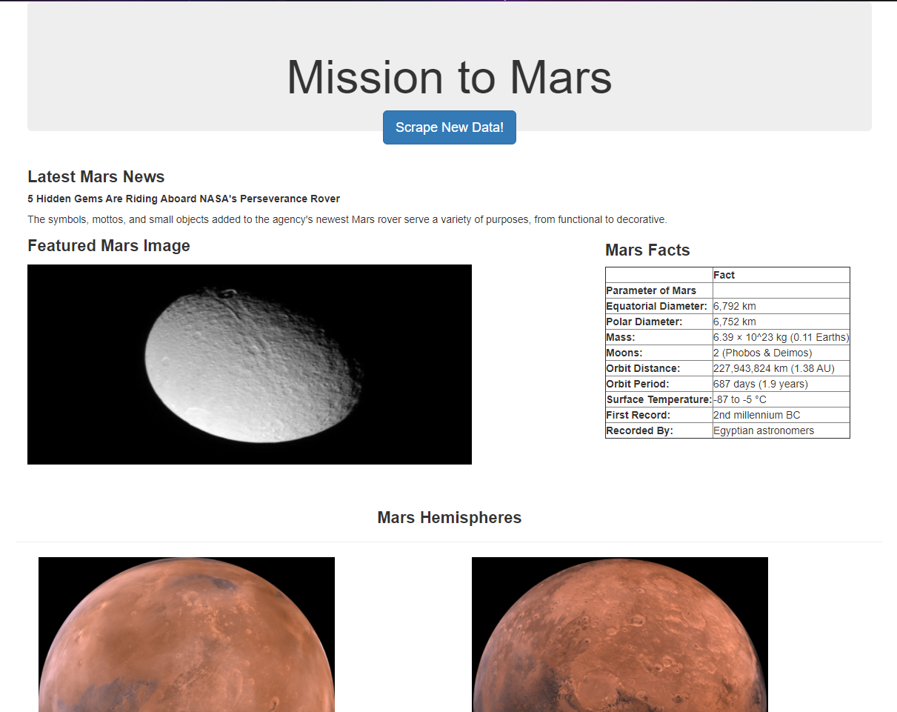
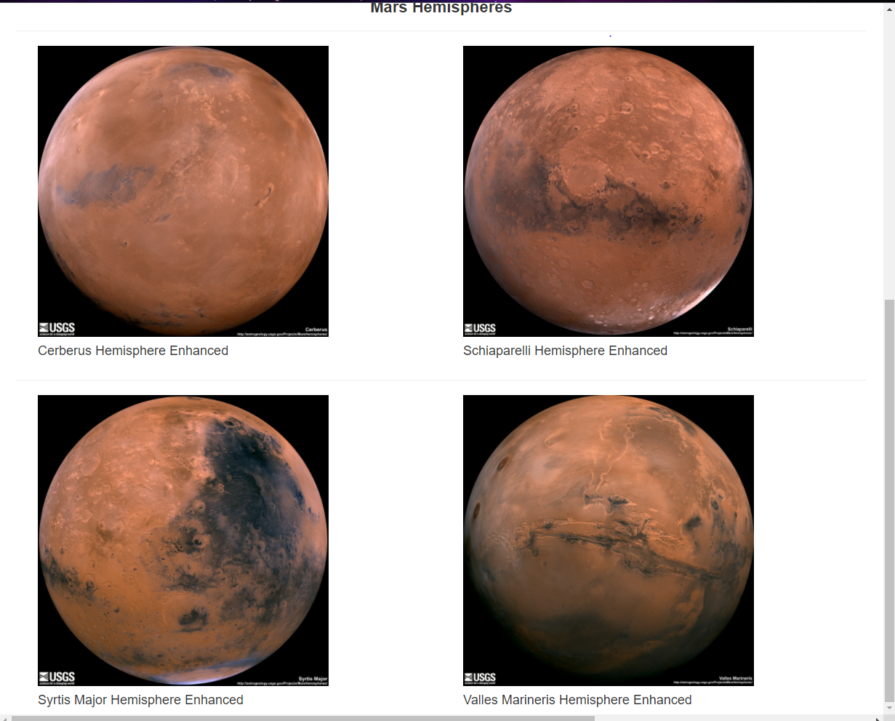

# Web Scraping Challenge

## Background

This respository contains a project where I built a web application that scrapes various websites for data related to the Mission to Mars and displays all of this information on an HTML page.

## Part 1 - Scraping

First I needed to use a combination of Jupyter Notebook, BeautifulSoup, Pandas and Requests/Splinter to scrape a few websites.

* I made a Jupyter Notebook file called [`mission_to_mars.ipynb`](mission_to_mars.ipynb) and used it to complete all of my scraping and analysis tasks. 

### NASA Mars News

* Here, I scraped the [NASA Mars News Site](https://mars.nasa.gov/news/) and collected the latest News Title and Paragraph Text. With these scraps I assigned the text to the variables `recent_title` and `recent_paragraph` respectively.

### JPL Mars Space Images - Featured Image

* I next used splinter to navigate this [JPL Featured Space Image site](https://www.jpl.nasa.gov/spaceimages/?search=&category=Mars) to find the image url for the current Featured Mars Image and assigned the complete url string to a variable called `featured_image_url`.

### Mars Facts

* Now hopping to the [Mars Facts webpage](https://space-facts.com/mars/), I used Pandas to scrape the table containing facts about the planet including Diameter, Mass, etc. I then took the table and used Pandas to convert the data to a HTML table string.

### Mars Hemispheres

* The last site I went to the [USGS Astrogeology site](https://astrogeology.usgs.gov/search/results?q=hemisphere+enhanced&k1=target&v1=Mars) to obtain high resolution images for each of Mar's hemispheres.

* After saving both the image url string for the full resolution hemisphere image, and the Hemisphere title containing the hemisphere name, I used a Python dictionary to store the data using the keys `img_url` and `title`.

* I appended the dictionary with each image url string and hemisphere title pair to a list which contains one dictionary for each hemisphere.

## Part 2 - MongoDB and Flask Application

For this part, I used MongoDB with Flask templating to create a new HTML page that displays all of the information that was scraped from the URLs above.

* First, I converted my Jupyter notebook into a Python script called `scrape_mars.py` with a function called `scrape` that executes all of my scraping code from above and returns one Python dictionary containing all of the scraped data.

* Next, I created a route called `/scrape` that imported my`scrape_mars.py` script and called my `scrape` function.

  * The return value was stored in Mongo as a Python dictionary.

* The root route `/` queries my Mongo database and passes the mars data into an HTML template to display the data.

* `index.html` is a template HTML file that then takes the mars data dictionary and displays all of the data in the appropriate HTML elements.

Here are some pictures of the final website:

